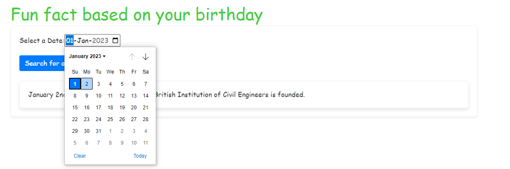

# Birthday Fun Facts

## Description

Birthday Fun Facts is a web application that allows you to explore interesting and surprising facts related to your birthday. Simply select your birthdate using the date picker, click "Search," and unveil a fun fact associated with that specific date. The application uses the NumbersAPI to fetch historical and mathematical trivia for your chosen date.

## How to Use

1. Access the Birthday Fun Facts web application.
2. Use the date picker to select your birthdate. The date picker ensures that you can only choose a valid date between January 1 and December 31.
3. Click the "Search" button to retrieve a fascinating fact related to your birthday.
4. A card will appear with the fun fact. Be prepared to be amazed!

## Technologies Used

- React: The front-end user interface is built using React, a popular JavaScript library for building user interfaces.
- React Bootstrap: The application's UI is styled using React Bootstrap, providing a sleek and responsive design.
- Axios: Axios is used to fetch data from the NumbersAPI, enabling the display of fun facts based on the user's selected date.

## Installation and Setup

1. Clone the repository: `git clone https://github.com/porto-o/birthday-fun-facts.git`
2. Navigate to the project directory: `cd birthday-fun-facts`
3. Install dependencies: `npm install`
4. Run the application: `npm start`
5. Open your web browser and go to `http://localhost:3000` to access Birthday Fun Facts.

## Screenshots

## License

This project is licensed under the [MIT License](LICENSE).

## Credits

- This project was created by [Ismael Porto](https://github.com/porto-o).
- The NumbersAPI used in this project can be found at [NumbersAPI](http://numbersapi.com).
- The React library and React Bootstrap were used to build the user interface. Learn more about them at [React](https://reactjs.org) and [React Bootstrap](https://react-bootstrap.github.io).

Feel free to contribute to the project or report any issues you encounter. Happy exploring the fun facts about your birthday! 🎉
